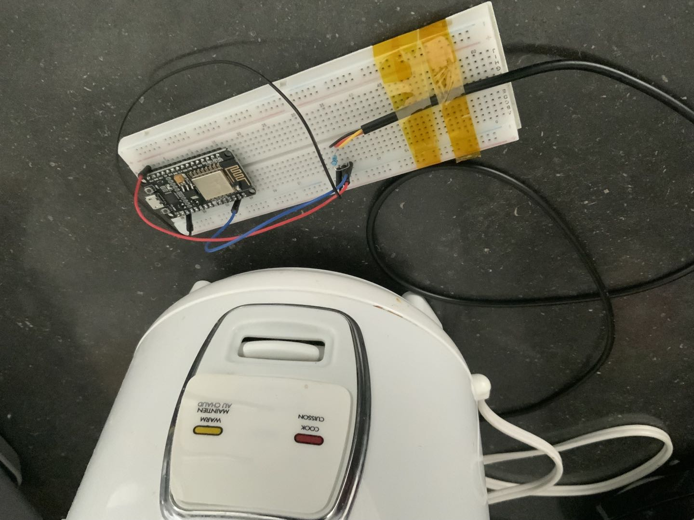
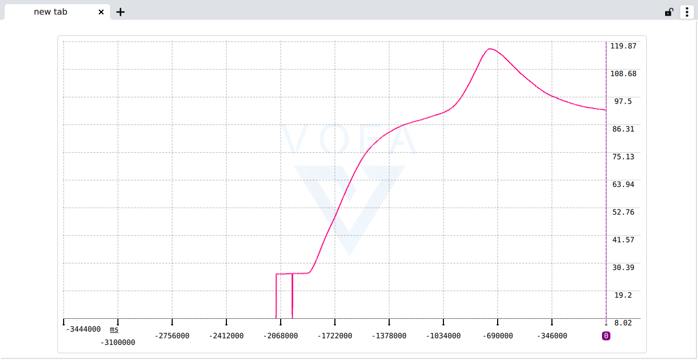

# esp8266_temp_collector

The five years old rice cooker doesn't cook rice in a good flavor. I am going to teach it how to cook rice.

Currently, this small project is used to collect some temperature data. 

Feb20: got a nice temperature plot

